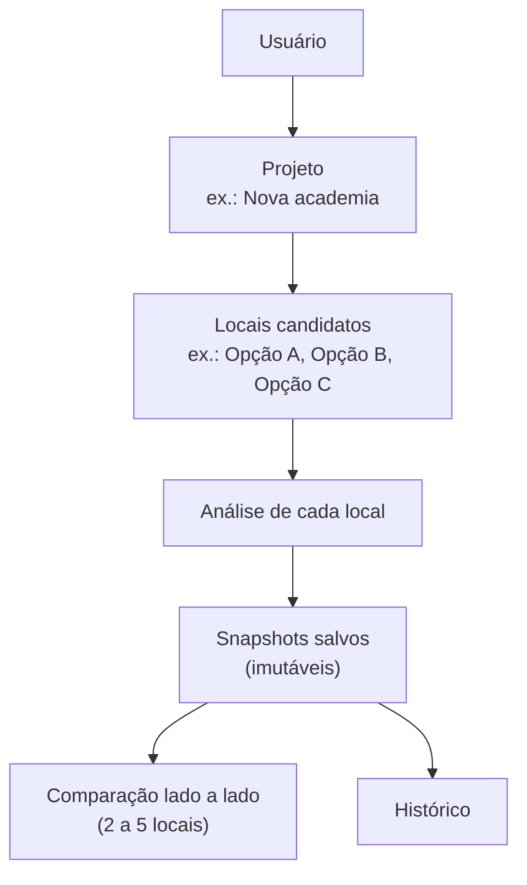
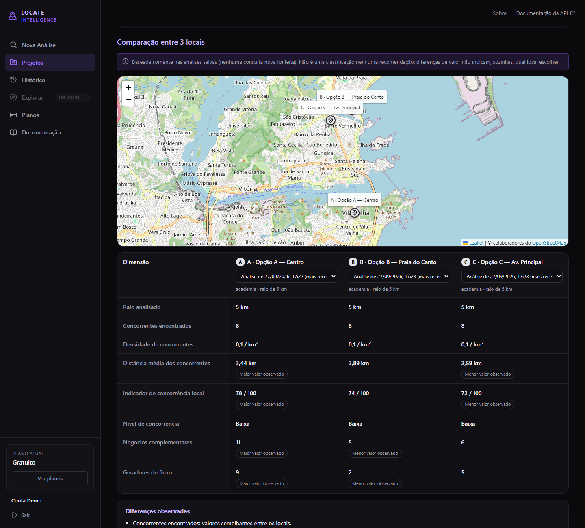
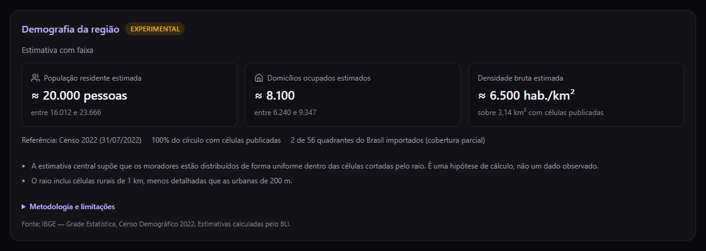
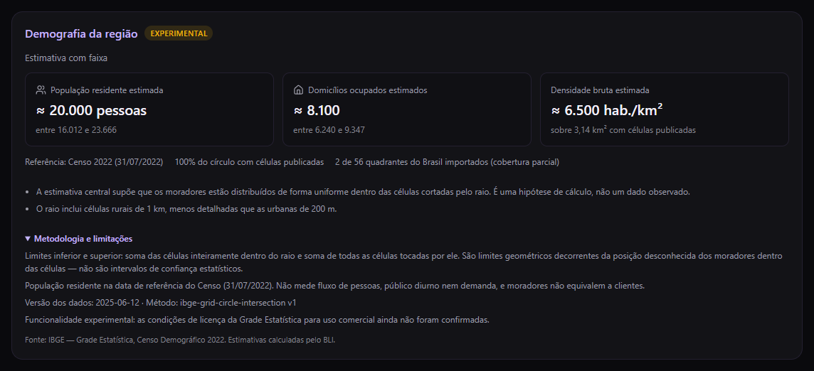
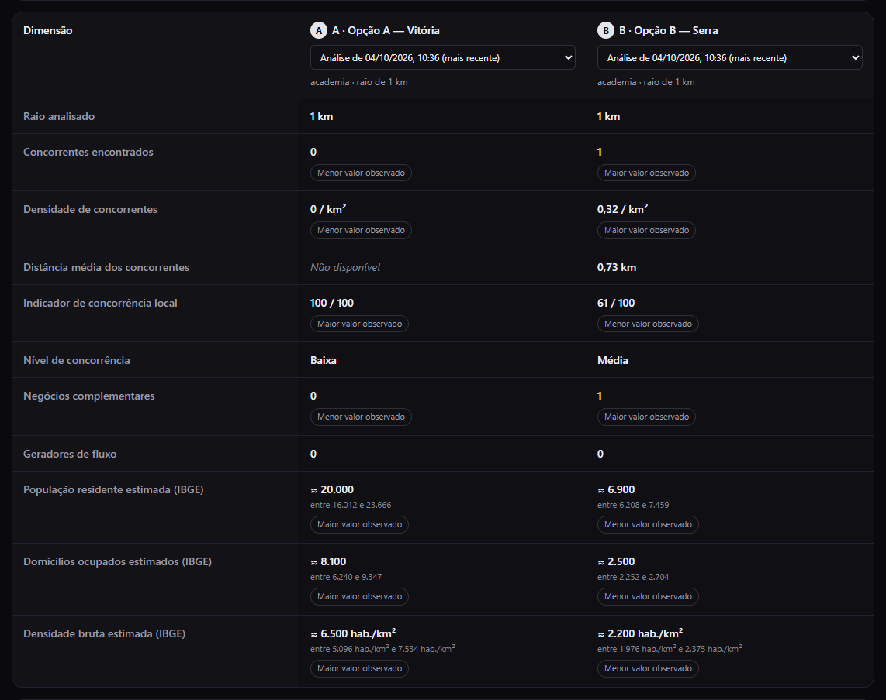
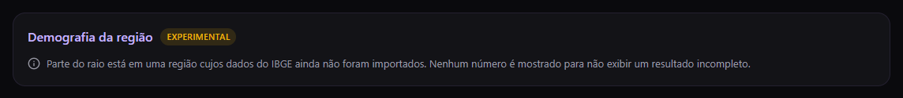
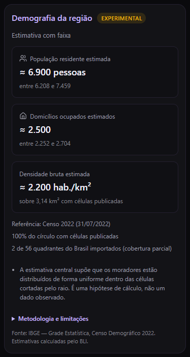
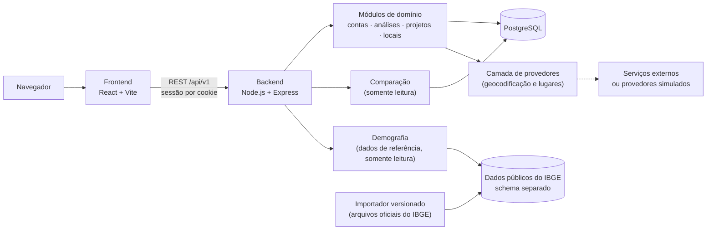

# Business Location Intelligence (BLI)

**Entenda uma região antes de investir nela.**

O BLI é uma plataforma web de inteligência de localização para apoiar a análise prévia de pontos comerciais. Você escolhe um ponto no mapa, informa o tipo de negócio e o raio, e recebe um panorama da concorrência e do contexto comercial ao redor e, desde a v0.7, uma **estimativa experimental da população e dos domicílios** da região, com base no Censo 2022 do IBGE. As análises podem ser salvas, organizadas em projetos com os locais que você está considerando e comparadas lado a lado.

> **O que o BLI não faz:** não prevê sucesso, não garante demanda e não escolhe automaticamente o melhor ponto. Ele organiza informações para apoiar uma decisão que continua sendo sua.

> **Sobre este repositório:** é uma apresentação pública do projeto. O código-fonte da aplicação é privado e **não** está incluído aqui. Veja [NOTICE.md](NOTICE.md).

---

## O problema

Antes de abrir ou expandir um negócio, é preciso avaliar a localização, a concorrência próxima, o contexto comercial da região e as alternativas de ponto. Na prática, essas informações ficam espalhadas entre mapas, buscas avulsas e anotações, e não há registro do que foi visto em cada momento.

O BLI organiza esse processo em um só lugar: escolha do ponto, análise, registro do resultado e comparação entre os locais considerados.

## Como funciona

1. **Crie um projeto:** um estudo, como "Nova academia", com objetivo, tipo de negócio e região.
2. **Adicione locais candidatos:** por endereço, pela sua localização atual, clicando no mapa ou arrastando o marcador.
3. **Analise cada local:** concorrentes encontrados no raio escolhido, densidade, distâncias, contexto comercial, um indicador descritivo de concorrência local e a demografia estimada da região (experimental).
4. **Salve o resultado:** a análise vira um *snapshot*, um registro fiel daquele momento que não muda depois.
5. **Compare locais:** escolha de 2 a 5 locais do projeto e veja as diferenças entre as análises salvas, lado a lado.
6. **Consulte o histórico:** reabra qualquer análise salva sem refazer consultas.

A análise também pode ser feita de forma avulsa, sem projeto, direto na tela "Nova Análise".

## Funcionalidades disponíveis (v0.7)

| Área | O que existe hoje |
|---|---|
| Conta | Cadastro, login e logout; sessão mantida ao recarregar a página |
| Seleção do ponto | Busca por endereço, localização do navegador, clique no mapa, arrastar o marcador; identificação automática do endereço do ponto quando possível |
| Análise | Concorrentes no raio escolhido, densidade por km², distância média, nível de concorrência e **indicador de concorrência local (0–100)**, que é descritivo e não uma recomendação |
| Contexto comercial | Negócios complementares e possíveis geradores de fluxo próximos, para os tipos de negócio com perfil mapeado |
| Análises salvas | Salvar apenas por ação explícita; snapshots imutáveis e versionados; reabrir sem nova consulta; excluir |
| Histórico | Lista paginada das análises salvas, com projeto e local quando houver |
| Projetos | Criar, listar, editar e excluir estudos (objetivo: novo negócio ou expansão) |
| Locais candidatos | Adicionar pelo mapa, renomear, anotar, remover; ver todos no mapa do projeto; analisar cada um e salvar as análises vinculadas a ele |
| Comparação | 2 a 5 locais do mesmo projeto, lado a lado, a partir das análises salvas (a mais recente de cada local por padrão); diferenças apresentadas em linguagem neutra; pontos no mapa quando permitido |
| **Demografia (experimental)** | População residente e domicílios ocupados **estimados** no raio, com limites inferior e superior, a partir da Grade Estatística do Censo 2022 do IBGE; ano de referência, cobertura, origem dos dados e limitações; incluída nas análises salvas e na comparação |
| Privacidade e isolamento | Cada usuário vê apenas os próprios dados; recursos de outros usuários respondem como inexistentes |

Interface em português do Brasil. Nas capturas, os dados de estabelecimentos são **dados de demonstração**, gerados pelos provedores simulados usados em desenvolvimento. Os dados demográficos das capturas da v0.7 são **estimativas reais** calculadas pelo BLI a partir dos arquivos oficiais do IBGE para pontos de Vitória e Serra (ES).

## Comparação entre locais

A comparação responde a uma pergunta: *quais são as diferenças entre os pontos que estou considerando?* Ela **não** responde qual escolher.

- Usa somente **análises já salvas**, por padrão a mais recente de cada local. Não executa nova análise, não consulta provedores externos, não altera snapshots e não é gravada: é calculada no momento em que é aberta.
- Mostra lado a lado: raio analisado, concorrentes encontrados, densidade de concorrentes, distância média dos concorrentes, indicador de concorrência local, nível de concorrência, negócios complementares e geradores de fluxo.
- Destaca apenas o **maior e o menor valor observado**, em texto. Não há ranking, nota geral, "melhor local" ou estimativa de sucesso.
- **Mais concorrência não é automaticamente pior, e menos concorrência não é automaticamente melhor.** Muitos concorrentes podem indicar mercado disputado, concentração do segmento ou presença de demanda; a comparação apresenta o contexto e deixa a interpretação com o usuário.
- Dados ausentes aparecem como ausentes ("Não disponível", "Não se aplica"), nunca como zero. Valores produzidos por versões diferentes do método de análise não são comparados entre si.

## Inteligência demográfica (experimental)

Além de *quais negócios existem ao redor de um ponto*, o BLI passa a responder **o que se sabe sobre as pessoas que moram na região**.

- **Fonte oficial:** Grade Estatística do Censo Demográfico 2022 do IBGE, com células de 200 m nas áreas urbanas e de 1 km nas rurais, contendo população residente e domicílios ocupados. Data de referência: 31/07/2022.
- **Como o número é obtido:** o BLI cruza o círculo da análise com as células oficiais. O **limite inferior** soma as células inteiramente dentro do raio; o **limite superior** soma todas as células tocadas por ele. A **estimativa central** supõe moradores distribuídos de forma uniforme dentro das células da borda (uma hipótese de cálculo) e só é mostrada quando a faixa é estreita o suficiente.
- **Estimativas, não contagens exatas.** Os limites são geométricos, decorrentes da posição desconhecida dos moradores dentro das células; **não são intervalos de confiança estatísticos**. Os valores são arredondados para evitar falsa precisão.
- **Estados honestos:** "Dados insuficientes para estimativa" (raios pequenos ou áreas rurais), "somente a faixa" quando a incerteza é alta, cobertura parcial e áreas sem células publicadas (como o mar) nunca aparecem como zero.
- **Moradores não são clientes.** A grade mede onde as pessoas moram, não fluxo, público diurno ou demanda. Há aviso quando o raio inclui células típicas de domicílios coletivos (presídios, quartéis, instituições).
- **Raio em metros reais em todo o Brasil:** a correção local de escala da projeção cartográfica foi validada contra distâncias geodésicas, do Oiapoque ao Chuí.
- **Validação do critério de precisão:** a regra que decide quando mostrar a estimativa central foi testada com dados oficiais de seis regiões (São Paulo, Manaus, Recife, Porto Alegre, Brasília e Vitória).
- **Proveniência registrada:** cada análise salva guarda a versão dos dados do IBGE, a versão do método e a cobertura usada. A comparação só confronta resultados com a mesma versão de dados e de método, e só destaca maior e menor valor quando as faixas **não se sobrepõem**.

| | |
|---|---|
|  |  |
| **Análise salva:** estimativas, metodologia e atribuição | **Comparação:** faixas lado a lado, sem ranking |
|  |  |
| **Cobertura parcial:** nenhum número quando faltam dados | **Celular:** layout responsivo |

**Limitações importantes**

- Dados do **Censo 2022**, não a população atual.
- Estimativas dentro do círculo, **não contagens exatas**; intervalos de incerteza **geométrica**, não estatística.
- **Cobertura depende dos quadrantes importados.** O sistema suporta os 56 quadrantes oficiais do Brasil, mas o ambiente demonstrado tem hoje **2 quadrantes** importados (Espírito Santo e entorno). Fora deles, a interface informa que os dados não estão disponíveis.
- **Restrições para coordenadas do Google:** por cautela com os termos de uso do provedor, a demografia só é calculada para pontos posicionados pelo usuário no mapa, ajustados no marcador, informados como coordenadas ou obtidos da localização do dispositivo. Pontos vindos de busca de endereço e coordenadas de estabelecimentos não são cruzados com os dados do IBGE.
- **Licença para uso comercial pendente de confirmação.** O IBGE publica a grade de forma aberta, mas não foi encontrada uma licença específica do conjunto de dados. Por isso, a funcionalidade é **experimental** e não está liberada para uso comercial até a confirmação.
- Não há, nesta versão, rendimento, faixas etárias, previsão de demanda ou potencial de faturamento.

Atribuição exibida no produto: *Fonte: IBGE — Grade Estatística, Censo Demográfico 2022. Estimativas calculadas pelo BLI.*

## Capturas de tela

| | |
|---|---|
|  |  |
| **Login** | **Análise salva:** snapshot com versões e indicador |
|  |  |
| **Projetos** | **Projeto:** locais candidatos no mapa |
|  |  |
| **Local candidato:** notas e análises relacionadas | **Histórico** |

## Arquitetura (visão geral)

- **Monólito modular:** um único backend, organizado em módulos de domínio com fronteiras claras, sem a complexidade operacional de microsserviços que o estágio atual não justifica.
- **Provedores desacoplados:** a análise depende de contratos, não de um fornecedor específico. Provedores simulados e determinísticos permitem desenvolver e testar sem custo nem chamadas externas.
- **Comparação como camada de leitura:** lê snapshots salvos e monta a visão comparativa, sem gravar nada e sem acionar provedores.
- **Dados públicos separados dos dados dos usuários:** os dados do IBGE ficam em um schema próprio, importados por uma ferramenta versionada e lidos pela aplicação apenas em modo somente leitura, sem PostGIS e sem serviços adicionais.
- **API REST versionada** (`/api/v1`), documentada com OpenAPI.
- **Frontend e backend separados**, projetados para operar na mesma origem (em desenvolvimento, via proxy), o que simplifica cookies de sessão e dispensa CORS aberto.

Mais detalhes em [docs/ARCHITECTURE.md](docs/ARCHITECTURE.md).

## Decisões de engenharia

- **Snapshots imutáveis e versionados.** Uma análise salva registra o resultado daquele momento, com as versões do motor, do formato e do método de cálculo. Reabrir nunca consulta provedores de novo, e o próprio banco rejeita alterações. Uma visão atualizada é sempre uma nova análise.
- **Projeto → Local candidato → Análise.** Um local candidato é o ponto em estudo, não uma análise. Um local acumula várias análises ao longo do tempo, e é sobre elas que a comparação trabalha.
- **Comparação derivada, não recomendação.** A comparação é calculada sob demanda a partir dos snapshots; não existe tabela de comparações. O versionamento dos snapshots permite recusar comparações entre resultados produzidos por métodos diferentes, em vez de misturá-los.
- **Linguagem neutra verificada por testes.** Testes impedem que a tela de comparação passe a usar termos de ranking ou recomendação.
- **Histórico preservado.** Excluir um projeto ou um local não apaga as análises salvas: elas continuam no histórico, apenas desvinculadas.
- **Posse verificada no servidor.** O dono de cada recurso vem sempre da sessão, nunca de um campo enviado pelo navegador. O isolamento é garantido nas consultas e reforçado por restrições no banco de dados.
- **Nada é salvo sem ação do usuário.** Escolher ou mover um ponto não executa análise nem grava nada; a localização do navegador não é armazenada por si só.
- **Coordenadas fora da URL.** Nos fluxos novos, a localização e as seleções trafegam no corpo das requisições, e os logs não registram parâmetros de consulta.
- **Termos de provedores levados a sério.** Conteúdo de terceiros é armazenado apenas na medida permitida pelos termos do provedor. O mapa se adapta ao provedor em uso.
- **Testes nunca chamam serviços pagos.** O ambiente de testes bloqueia chamadas reais a provedores externos.
- **Migrations versionadas** para toda mudança de schema, com idempotência verificada no CI.
- **Importação de dados oficiais verificável.** Cada arquivo do IBGE é validado por inteiro (integridade, estrutura e a geometria oficial de cada célula), importado em uma transação por quadrante, de forma idempotente e retomável, e publicado de uma só vez. Uma nova publicação vira uma nova versão, sem sobrescrever a anterior.
- **Ausência não é zero, em todo lugar.** Dados não importados, áreas sem células, falhas de consulta e origens de ponto não permitidas têm estados próprios.

## Segurança (resumo)

Senhas armazenadas apenas como hash; sessões no servidor com cookies protegidos; proteção contra requisições de outras origens; validação de toda entrada; consultas parametrizadas; limites de taxa; cabeçalhos de segurança; logs sem dados sensíveis; segredos apenas em variáveis de ambiente. Detalhes em alto nível em [docs/SECURITY.md](docs/SECURITY.md).

## Qualidade

| Verificação | Estado atual (v0.7) |
|---|---|
| Testes automatizados de backend | **951** (incluindo suítes contra PostgreSQL real) |
| Testes automatizados de frontend | **295** |
| Total | **1246** |
| Lint (backend e frontend) | sem erros |
| Build do frontend | aprovado |
| CI | lint, migrations (com verificação de idempotência), testes e build em push para a branch principal e em pull requests |
| Smoke tests | fluxos completos executados em navegador, em ambiente local; na v0.7, com dados oficiais do IBGE importados |

Os testes cobrem, entre outros: isolamento entre usuários (inclusive em rotas aninhadas e na comparação), imutabilidade dos snapshots, reabertura e comparação sem chamadas a provedores, dados ausentes que nunca viram zero, validação, limites de payload, indisponibilidade do banco e restrições de integridade. Na v0.7: projeção cartográfica conferida contra a geometria oficial do IBGE e contra distâncias geodésicas independentes em várias regiões do Brasil, células nas bordas, importação (arquivo inválido, hash divergente, duplicidade, interrupção e retomada, publicação atômica), estados de cobertura e regras de comparação das faixas.

## Stack

**Frontend:** React, Vite, React Router, Leaflet (mapas OpenStreetMap), CSS Modules, Vitest, Testing Library
**Backend:** Node.js, Express, validação de esquemas, logs estruturados, OpenAPI, Jest, Supertest
**Dados:** PostgreSQL, SQL parametrizado e migrations versionadas (sem ORM); dados públicos do IBGE (Censo 2022) importados por ferramenta própria, sem PostGIS
**Qualidade:** ESLint, GitHub Actions, testes contra banco real

Resumo da API em [docs/API_OVERVIEW.md](docs/API_OVERVIEW.md) e exemplo ilustrativo de resposta em [examples/analysis-response.example.json](examples/analysis-response.example.json).

## Status do projeto

**Em desenvolvimento ativo.** Estado atual do desenvolvimento: **v0.7**, com a demografia em caráter **experimental**. Ainda não há release pública.

O que já existe e o que está planejado estão em [docs/ROADMAP.md](docs/ROADMAP.md). O produto é descrito em [docs/PRODUCT.md](docs/PRODUCT.md).

## Autor

Kelvin Simões, desenvolvedor backend.

## Aviso

Este repositório não contém o código-fonte da aplicação e não é open source. Todos os direitos reservados, salvo indicação em contrário. Veja [NOTICE.md](NOTICE.md).
