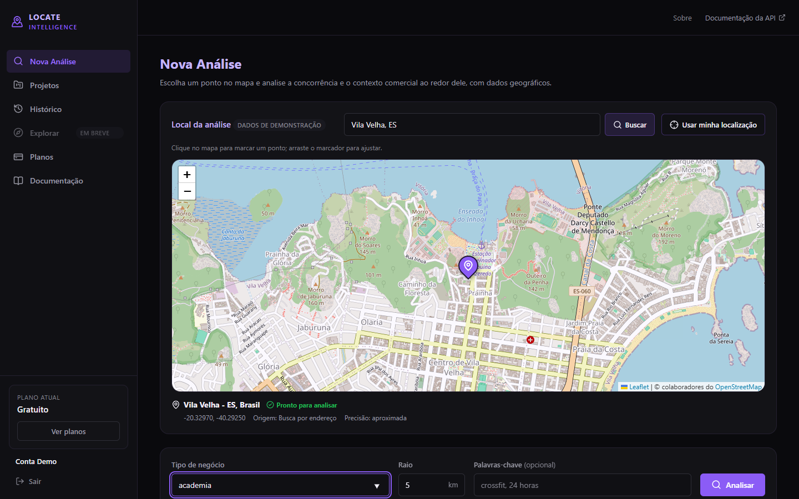
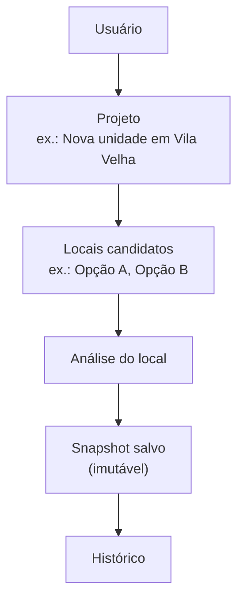
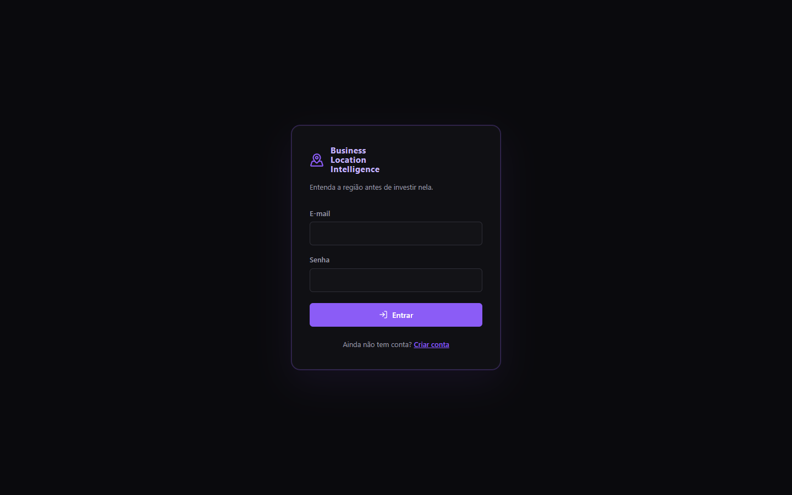
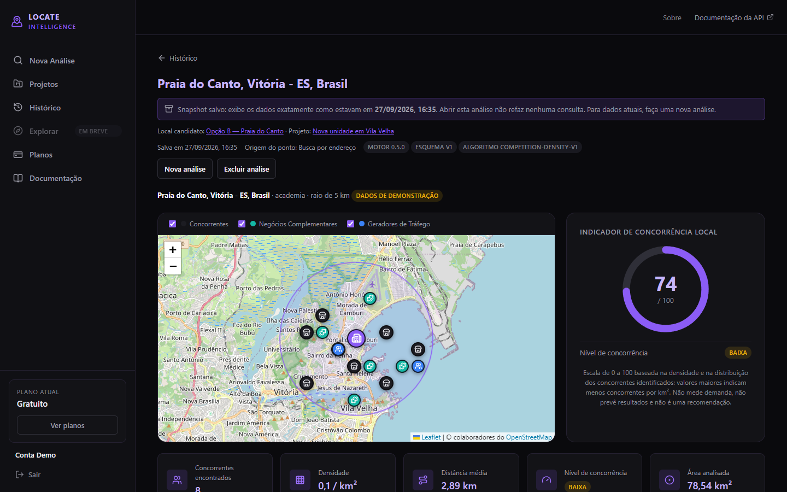
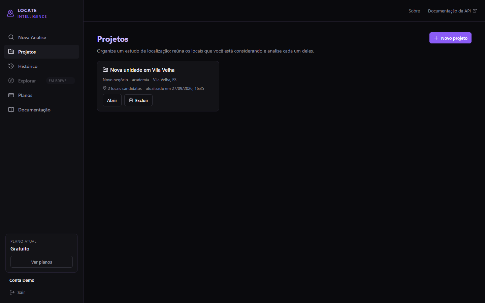
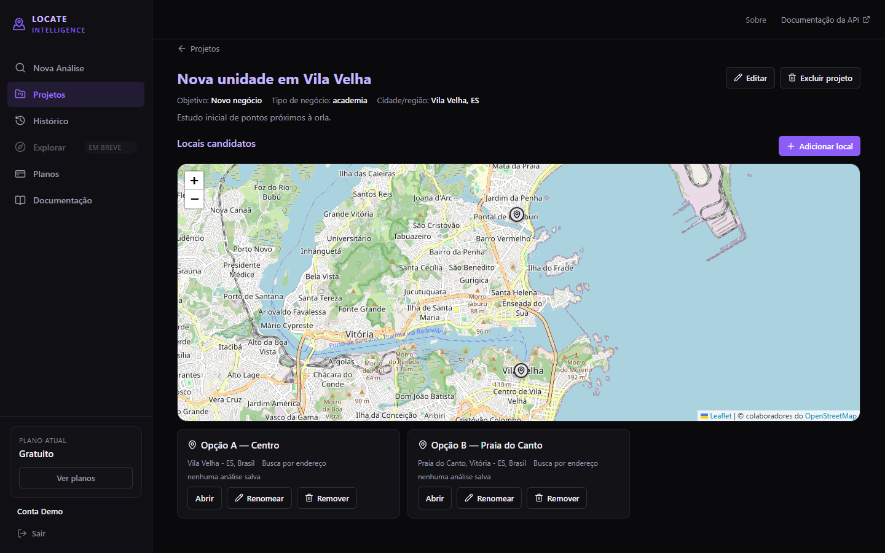
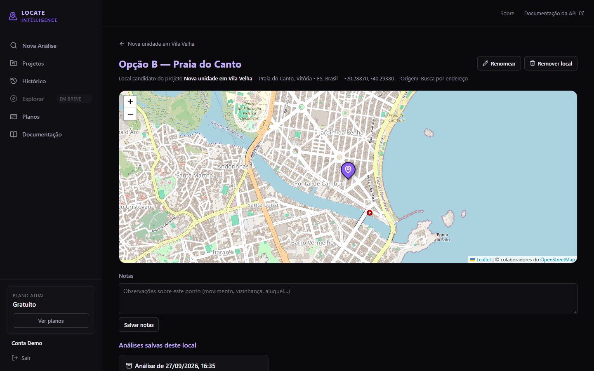
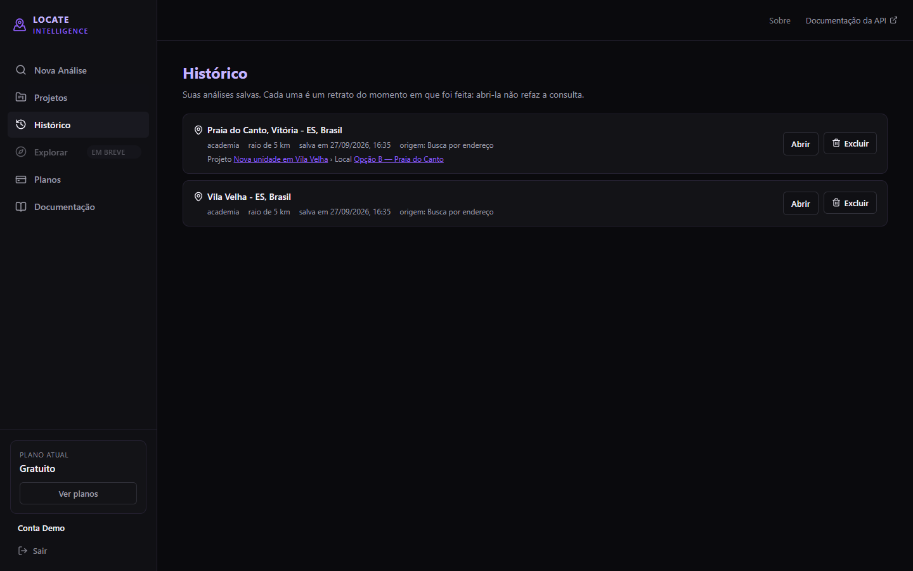
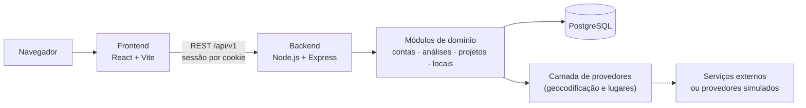

# Business Location Intelligence (BLI)

**Entenda uma região antes de investir nela.**

O BLI é uma plataforma web de inteligência de localização para apoiar a análise prévia de pontos comerciais. Você escolhe um ponto no mapa, informa o tipo de negócio e o raio, e recebe um panorama da concorrência e do contexto comercial ao redor. As análises podem ser salvas e organizadas em projetos, com os locais que você está considerando.

> **O que o BLI não faz:** não prevê sucesso, não garante demanda e não escolhe automaticamente o melhor ponto. Ele organiza informações para apoiar uma decisão que continua sendo sua.

> **Sobre este repositório:** é uma apresentação pública do projeto. O código-fonte da aplicação é privado e **não** está incluído aqui. Veja [NOTICE.md](NOTICE.md).

---

## O problema

Antes de abrir ou expandir um negócio, é preciso avaliar a localização, a concorrência próxima, o contexto comercial da região e as alternativas de ponto. Na prática, essas informações ficam espalhadas entre mapas, buscas avulsas e anotações, e não há registro do que foi visto em cada momento.

O BLI organiza esse processo: escolha do ponto, análise, registro do resultado e comparação posterior feita pelo próprio usuário, tudo em um só lugar.

## Como funciona

1. **Crie um projeto:** um estudo, como "Nova unidade em Vila Velha", com objetivo, tipo de negócio e região.
2. **Adicione locais candidatos:** por endereço, pela sua localização atual, clicando no mapa ou arrastando o marcador.
3. **Analise cada local:** concorrentes encontrados no raio escolhido, densidade, distâncias e um indicador descritivo de concorrência local.
4. **Salve o resultado:** a análise vira um *snapshot*, um registro fiel daquele momento que não muda depois.
5. **Consulte o histórico:** reabra qualquer análise salva sem refazer consultas.

A análise também pode ser feita de forma avulsa, sem projeto, direto na tela "Nova Análise".

## Funcionalidades disponíveis (v0.5)

| Área | O que existe hoje |
|---|---|
| Conta | Cadastro, login e logout; sessão mantida ao recarregar a página |
| Seleção do ponto | Busca por endereço, localização do navegador, clique no mapa, arrastar o marcador; identificação automática do endereço do ponto quando possível |
| Análise | Concorrentes no raio escolhido, densidade por km², distância média, nível de concorrência e **indicador de concorrência local (0–100)**, que é descritivo e não uma recomendação |
| Contexto comercial | Negócios complementares e possíveis geradores de fluxo próximos, para os tipos de negócio com perfil mapeado |
| Análises salvas | Salvar apenas por ação explícita; snapshots imutáveis e versionados; reabrir sem nova consulta; excluir |
| Histórico | Lista paginada das análises salvas, com projeto e local quando houver |
| Projetos | Criar, listar, editar e excluir estudos (objetivo: novo negócio ou expansão) |
| Locais candidatos | Adicionar pelo mapa, renomear, anotar, remover; ver todos no mapa do projeto; analisar cada um e salvar as análises vinculadas a ele |
| Privacidade e isolamento | Cada usuário vê apenas os próprios dados; recursos de outros usuários respondem como inexistentes |

Interface em português do Brasil. Nas capturas, os dados de estabelecimentos são **dados de demonstração**, gerados pelos provedores simulados usados em desenvolvimento.

## Capturas de tela

| | |
|---|---|
|  |  |
| **Login** | **Análise salva:** snapshot com versões e indicador |
|  |  |
| **Projetos** | **Projeto:** locais candidatos no mapa |
|  |  |
| **Local candidato:** notas e análises relacionadas | **Histórico** |

## Arquitetura (visão geral)

- **Monólito modular:** um único backend, organizado em módulos de domínio com fronteiras claras, sem a complexidade operacional de microsserviços que o estágio atual não justifica.
- **Provedores desacoplados:** a análise depende de contratos, não de um fornecedor específico. Provedores simulados e determinísticos permitem desenvolver e testar sem custo nem chamadas externas.
- **API REST versionada** (`/api/v1`), documentada com OpenAPI.
- **Frontend e backend separados**, projetados para operar na mesma origem (em desenvolvimento, via proxy), o que simplifica cookies de sessão e dispensa CORS aberto.

Mais detalhes em [docs/ARCHITECTURE.md](docs/ARCHITECTURE.md).

## Decisões de engenharia

- **Snapshots imutáveis e versionados.** Uma análise salva registra o resultado daquele momento, com as versões do motor, do formato e do método de cálculo. Reabrir nunca consulta provedores de novo, e o próprio banco rejeita alterações. Uma visão atualizada é sempre uma nova análise.
- **Projeto → Local candidato → Análise.** Um local candidato é o ponto em estudo, não uma análise. Um local acumula várias análises ao longo do tempo, o que prepara o terreno para uma futura comparação entre locais.
- **Histórico preservado.** Excluir um projeto ou um local não apaga as análises salvas: elas continuam no histórico, apenas desvinculadas.
- **Posse verificada no servidor.** O dono de cada recurso vem sempre da sessão, nunca de um campo enviado pelo navegador. O isolamento é garantido nas consultas e reforçado por restrições no banco de dados.
- **Nada é salvo sem ação do usuário.** Escolher ou mover um ponto não executa análise nem grava nada; a localização do navegador não é armazenada por si só.
- **Coordenadas fora da URL.** Nos fluxos novos, a localização trafega no corpo das requisições, e os logs não registram parâmetros de consulta.
- **Termos de provedores levados a sério.** Conteúdo de terceiros é armazenado apenas na medida permitida pelos termos do provedor. O mapa se adapta ao provedor em uso.
- **Testes nunca chamam serviços pagos.** O ambiente de testes bloqueia chamadas reais a provedores externos.
- **Migrations versionadas** para toda mudança de schema, com idempotência verificada no CI.

## Segurança (resumo)

Senhas armazenadas apenas como hash; sessões no servidor com cookies protegidos; proteção contra requisições de outras origens; validação de toda entrada; consultas parametrizadas; limites de taxa; cabeçalhos de segurança; logs sem dados sensíveis; segredos apenas em variáveis de ambiente. Detalhes em alto nível em [docs/SECURITY.md](docs/SECURITY.md).

## Qualidade

| Verificação | Estado atual (v0.5) |
|---|---|
| Testes automatizados de backend | **771** (incluindo suítes contra PostgreSQL real) |
| Testes automatizados de frontend | **251** |
| Total | **1022** |
| Lint (backend e frontend) | sem erros |
| Build do frontend | aprovado |
| CI | lint, migrations (com verificação de idempotência), testes e build em push para a branch principal e em pull requests |
| Smoke tests | fluxos completos executados em navegador, em ambiente local |

Os testes cobrem, entre outros: isolamento entre usuários (inclusive em rotas aninhadas), imutabilidade dos snapshots, reabertura sem chamadas a provedores, validação, limites de payload, indisponibilidade do banco e restrições de integridade.

## Stack

**Frontend:** React, Vite, React Router, Leaflet (mapas OpenStreetMap), CSS Modules, Vitest, Testing Library
**Backend:** Node.js, Express, validação de esquemas, logs estruturados, OpenAPI, Jest, Supertest
**Dados:** PostgreSQL, SQL parametrizado e migrations versionadas (sem ORM)
**Qualidade:** ESLint, GitHub Actions, testes contra banco real

Resumo da API em [docs/API_OVERVIEW.md](docs/API_OVERVIEW.md) e exemplo ilustrativo de resposta em [examples/analysis-response.example.json](examples/analysis-response.example.json).

## Status do projeto

**Em desenvolvimento ativo.** Estado atual do desenvolvimento: **v0.5**. Ainda não há release pública.

O que já existe e o que está planejado estão em [docs/ROADMAP.md](docs/ROADMAP.md). O produto é descrito em [docs/PRODUCT.md](docs/PRODUCT.md).

## Autor

Kelvin Simões, desenvolvedor backend.

Desenvolvido com o apoio do Claude (Anthropic) como ferramenta de assistência para implementação, revisão de código, discussões de arquitetura e depuração.

## Aviso

Este repositório não contém o código-fonte da aplicação e não é open source. Todos os direitos reservados, salvo indicação em contrário. Veja [NOTICE.md](NOTICE.md).
