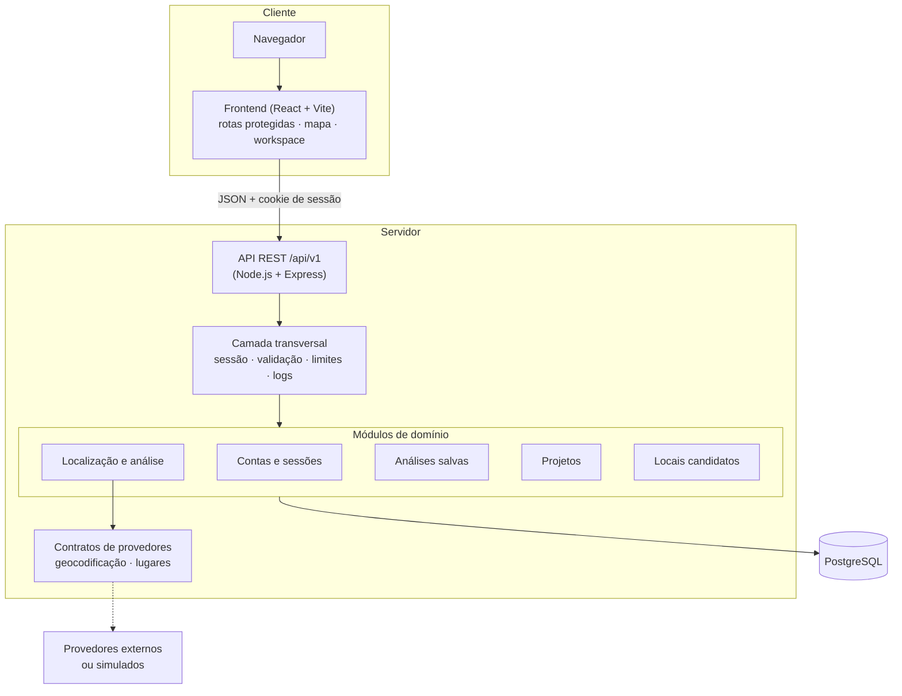
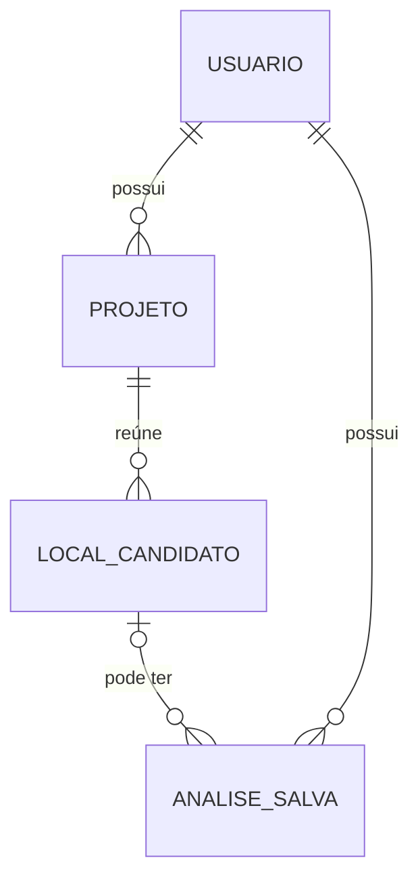

# Arquitetura (alto nível)

Este documento descreve a organização do sistema em nível conceitual. Detalhes de implementação, schema completo e código não são publicados.

## Visão geral

## Componentes

**Frontend.** Aplicação React (Vite) com rotas protegidas, um cliente HTTP único que envia o cookie de sessão e não guarda tokens no navegador, e um workspace de mapa (Leaflet/OpenStreetMap). As formas de escolher um ponto (endereço, localização do navegador, clique e arrasto) convergem para o mesmo estado.

**Backend.** Monólito modular em Node.js + Express. Cada módulo de domínio concentra suas rotas, validação e persistência. A composição é feita por injeção de dependências, o que permite testar o aplicativo com provedores simulados ou com um banco real sem alterar o código.

**Banco de dados.** PostgreSQL, acessado com SQL parametrizado e sem ORM. O schema evolui por migrations versionadas. Regras importantes, como posse dos dados, integridade entre entidades e imutabilidade dos snapshots, são reforçadas no próprio banco, além da aplicação.

**Provedores.** Geocodificação e busca de lugares ficam atrás de contratos. Existem implementações para um provedor externo e implementações simuladas determinísticas, usadas em desenvolvimento, testes e CI. Trocar o provedor não afeta o restante do sistema.

## Modelo conceitual

- Toda entidade pertence a um usuário.
- Uma análise salva pode existir sem local candidato (análise avulsa).
- Excluir um projeto remove seus locais candidatos, mas as análises salvas são preservadas no histórico, apenas desvinculadas.

## Decisões e motivos

| Decisão | Motivo |
|---|---|
| Monólito modular | Fronteiras claras entre domínios sem o custo operacional de serviços distribuídos no estágio atual |
| Snapshots imutáveis e versionados | Um resultado salvo precisa continuar significando a mesma coisa; versões permitem saber como ele foi produzido |
| Salvar só por ação explícita | Evita acumular dados, e dados de localização, que o usuário não pediu para guardar |
| Local candidato separado da análise | Um ponto é estudado várias vezes; a separação prepara uma futura comparação |
| Posse derivada da sessão | O navegador nunca informa quem é o dono de um recurso |
| Recursos de outros usuários respondem 404 | Não revela a existência de dados alheios |
| Provedores por contrato + simulados | Desenvolvimento e testes sem custo, determinísticos e sem chamadas externas |
| API versionada (`/api/v1`) | Permite evoluir contratos sem quebrar clientes |
| SQL parametrizado sem ORM | Controle explícito das consultas; interpolação de SQL é bloqueada por regra de lint |
| Mesma origem para frontend e API | Cookies de sessão mais seguros e sem CORS aberto |

## Qualidade e entrega

- Testes de unidade, integração e contra PostgreSQL real no backend; testes de componentes e de fluxos completos no frontend.
- Testes de arquitetura verificam automaticamente as regras de posse em toda camada de persistência nova.
- CI (GitHub Actions) com banco PostgreSQL efêmero: lint, migrations com verificação de idempotência, testes e build.
- Smoke tests em navegador cobrindo os fluxos principais, executados localmente com provedores simulados.
