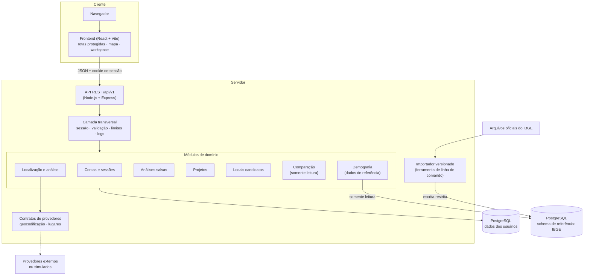
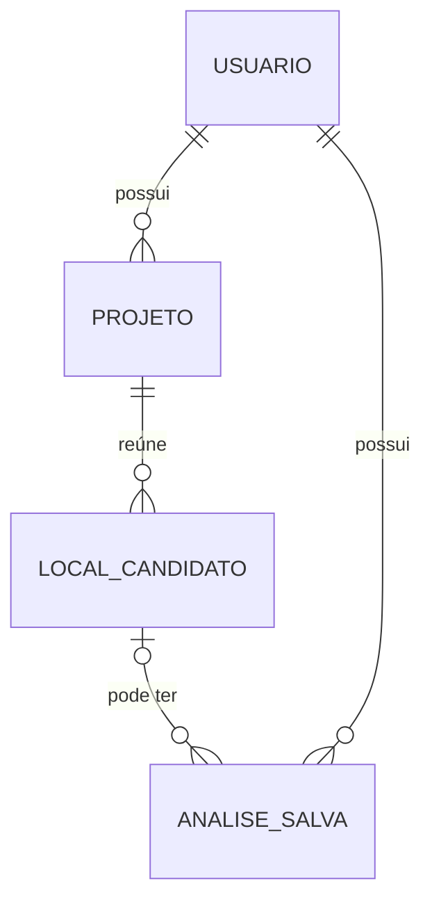
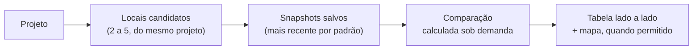

# Arquitetura (alto nível)

Este documento descreve a organização do sistema em nível conceitual. Detalhes de implementação, schema completo e código não são publicados.

## Visão geral

## Componentes

**Frontend.** Aplicação React (Vite) com rotas protegidas, um cliente HTTP único que envia o cookie de sessão e não guarda tokens no navegador, e um workspace de mapa (Leaflet/OpenStreetMap). As formas de escolher um ponto (endereço, localização do navegador, clique e arrasto) convergem para o mesmo estado.

**Backend.** Monólito modular em Node.js + Express. Cada módulo de domínio concentra suas rotas, validação e persistência. A composição é feita por injeção de dependências, o que permite testar o aplicativo com provedores simulados ou com um banco real sem alterar o código.

**Banco de dados.** PostgreSQL, acessado com SQL parametrizado e sem ORM. O schema evolui por migrations versionadas. Regras importantes, como posse dos dados, integridade entre entidades e imutabilidade dos snapshots, são reforçadas no próprio banco, além da aplicação.

**Comparação.** Uma camada de leitura sobre os dados já existentes. Ela recebe a seleção de locais de um projeto, lê os snapshots salvos correspondentes e monta a visão comparativa. Não grava nada (não existe tabela de comparações), não aciona provedores e não altera snapshots; a mesma seleção produz sempre a mesma comparação.

**Demografia (v0.7, experimental).** Um módulo independente que cruza o raio da análise com a Grade Estatística do Censo 2022 do IBGE. Os dados oficiais ficam em um schema separado dos dados dos usuários, sem vínculo com contas, e a aplicação os lê por uma conexão em que o próprio banco recusa qualquer escrita. O cálculo é feito na aplicação, com a projeção cartográfica oficial da grade e correção local de escala, sem PostGIS. A integração com a análise nunca é fatal: se os dados não estiverem disponíveis, a análise comercial continua e a seção informa o motivo.

**Importador.** Uma ferramenta de linha de comando, usada apenas por quem opera o sistema, que importa os arquivos oficiais do IBGE: verifica a integridade (SHA-256), valida cada registro (inclusive a geometria oficial de cada célula), grava em uma transação por quadrante, é idempotente e retomável após interrupções, e publica cada versão dos dados de uma só vez. Pode usar uma identidade de banco com permissão de escrita restrita às tabelas de referência.

**Provedores.** Geocodificação e busca de lugares ficam atrás de contratos. Existem implementações para um provedor externo e implementações simuladas determinísticas, usadas em desenvolvimento, testes e CI. Trocar o provedor não afeta o restante do sistema.

## Modelo conceitual

- Toda entidade pertence a um usuário.
- A comparação não é uma entidade: é derivada, no momento da leitura, de locais candidatos do mesmo projeto e de seus snapshots.
- Uma análise salva pode existir sem local candidato (análise avulsa).
- Excluir um projeto remove seus locais candidatos, mas as análises salvas são preservadas no histórico, apenas desvinculadas.
- Os dados demográficos de referência não pertencem a usuários: são públicos, versionados por publicação do IBGE e iguais para todos. Cada análise salva registra qual versão desses dados e qual versão do método produziram a sua estimativa.

## Fluxo de dados da comparação

## Decisões e motivos

| Decisão | Motivo |
|---|---|
| Monólito modular | Fronteiras claras entre domínios sem o custo operacional de serviços distribuídos no estágio atual |
| Snapshots imutáveis e versionados | Um resultado salvo precisa continuar significando a mesma coisa; versões permitem saber como ele foi produzido |
| Salvar só por ação explícita | Evita acumular dados, e dados de localização, que o usuário não pediu para guardar |
| Local candidato separado da análise | Um ponto é estudado várias vezes; a comparação trabalha sobre as análises de cada local |
| Comparação derivada, sem persistência | Evita dados duplicados e desatualizados; o resultado é sempre consistente com os snapshots |
| Comparação sem ranking | O produto apoia a decisão e não a toma; destaques são apenas maior e menor valor observado |
| Comparabilidade por versão | Snapshots registram como foram produzidos; resultados de métodos diferentes não são misturados |
| Posse derivada da sessão | O navegador nunca informa quem é o dono de um recurso |
| Recursos de outros usuários respondem 404 | Não revela a existência de dados alheios |
| Provedores por contrato + simulados | Desenvolvimento e testes sem custo, determinísticos e sem chamadas externas |
| API versionada (`/api/v1`) | Permite evoluir contratos sem quebrar clientes |
| SQL parametrizado sem ORM | Controle explícito das consultas; interpolação de SQL é bloqueada por regra de lint |
| Mesma origem para frontend e API | Cookies de sessão mais seguros e sem CORS aberto |
| Dados do IBGE importados, não consultados em tempo real | As consultas por raio exigem dados locais; versões fixas tornam as análises reproduzíveis e compatíveis com snapshots imutáveis |
| Schema separado e somente leitura para dados públicos | Dados de referência não se misturam com dados dos usuários, e a aplicação não consegue alterá-los |
| Sem PostGIS | A grade oficial é regular: uma busca por faixa de coordenadas e geometria na aplicação bastam, sem infraestrutura adicional |
| Estimativas com faixa e estimativa central condicional | Evita falsa precisão; o critério foi validado com dados oficiais de várias regiões |
| Versões independentes de dados e de método | Resultados de versões diferentes não são misturados na comparação |
| Cautela com coordenadas de provedores de mapas | Só pontos posicionados pelo usuário são cruzados com os dados do IBGE |

## Qualidade e entrega

- Testes de unidade, integração e contra PostgreSQL real no backend; testes de componentes e de fluxos completos no frontend.
- Testes de arquitetura verificam automaticamente as regras de posse em toda camada de persistência nova, e mantêm os dados públicos de referência em uma categoria própria e mais restrita (apenas leitura, sem tabelas nem identificadores de usuário).
- Na v0.7, a projeção é conferida contra a geometria oficial do IBGE e contra distâncias geodésicas calculadas de forma independente, e o importador é testado com arquivos inválidos, hashes divergentes, duplicidades, interrupções e retomadas.
- Testes garantem que abrir uma comparação não chama provedores, não grava dados e não altera snapshots, e que a tela não usa linguagem de ranking ou recomendação.
- CI (GitHub Actions) com banco PostgreSQL efêmero: lint, migrations com verificação de idempotência, testes e build.
- Smoke tests em navegador cobrindo os fluxos principais, executados localmente com provedores simulados.
